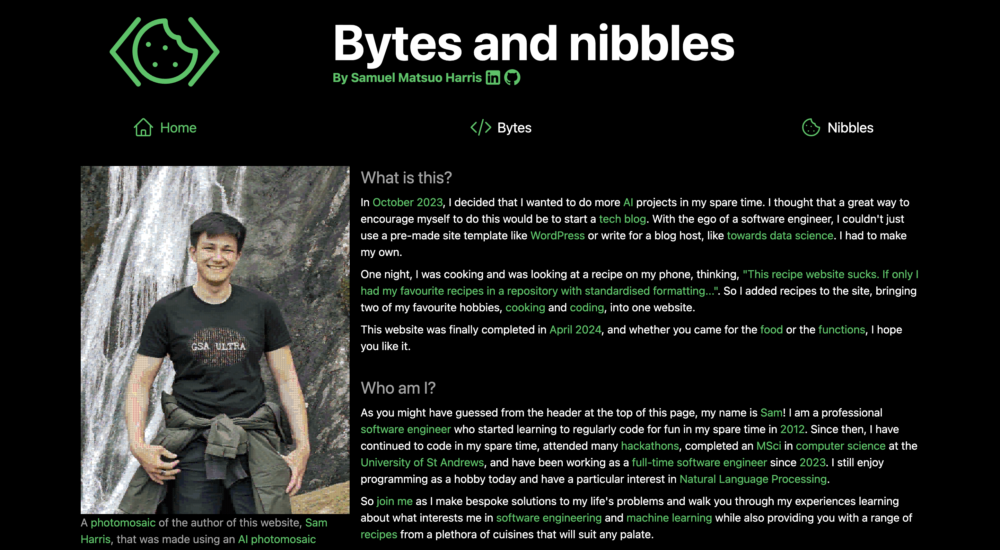

# Bytes and Nibbles Website

## Introduction

My tech blog and recipe website.

See my website hosted at [https://bytes-and-nibbles.web.app](https://bytes-and-nibbles.web.app).

## Usage instructions

Install dependencies: `npm install`.

Run locally: `npm run dev`.

Build to `out/`: `npm run build`.

Serve the build: `npx serve out`.

Configure the `.firebaserc` and `./app/common/firebaseConstants.ts` files to use your own firebase backend.
